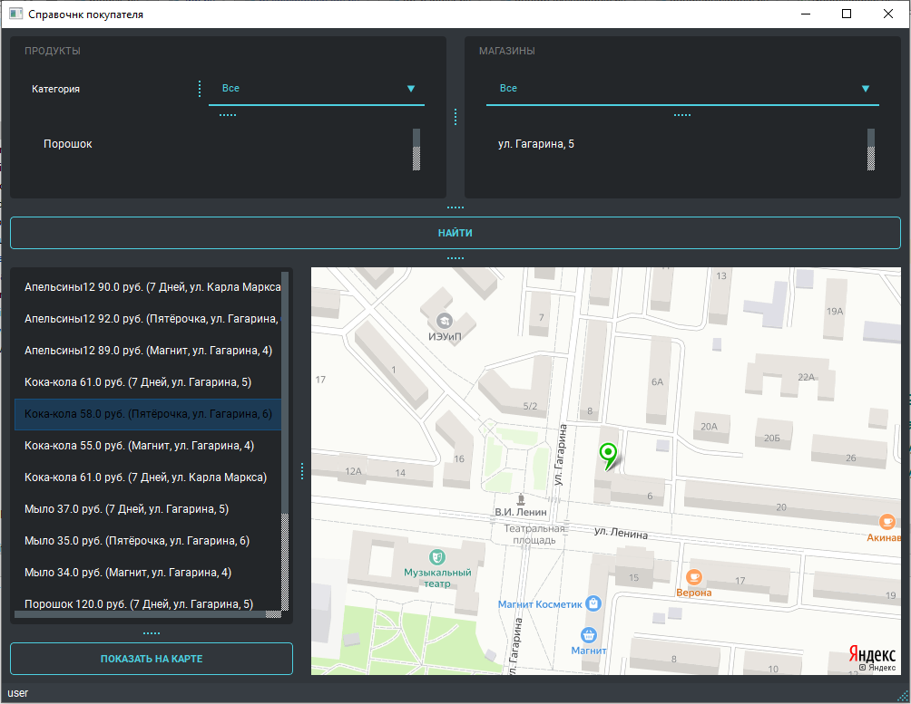
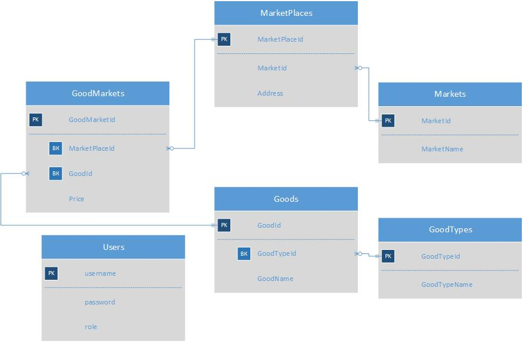

# Справочник покупателя

Приложение предназначено для того, чтобы найти где и в каком магазине находится самый дешёвый товар. 

## Идея программы
Часто бывает ситуация, когда перед покупкой товаров в магазине, мы хотим купить товар по акции или подешевле. Мы ходим по магазинам и тратим на это много времени. Было бы неплохо создать приложение, которое позволяло бы заранее узнать где и в каком магазине самый дешевый товар. Система многопользовательская. Есть две роли в системе:  администратор и пользователь. Администратору доступно меню для доступа к данным: магазинам и товарам. Пользователю доступна главная форма.

## Структура БД

## Реализация программы

Использована библиотека PyQt и SQLite база данных. Карта расположения магазина формируется на основе запроса к геокодеру Яндекса(https://yandex.ru/dev/maps/geocoder/).
Для работы приложения нужен интернет, а также API-ключ.

 
Краткое руководство пользователя
Форма авторизации и регистрации
 

