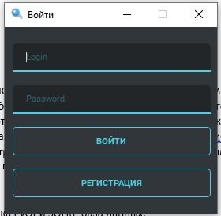
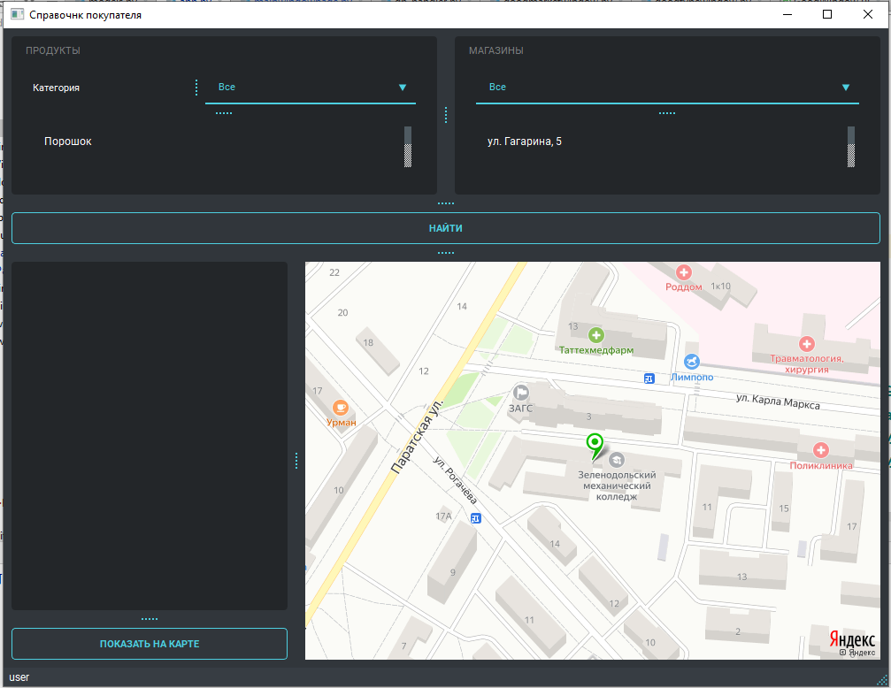
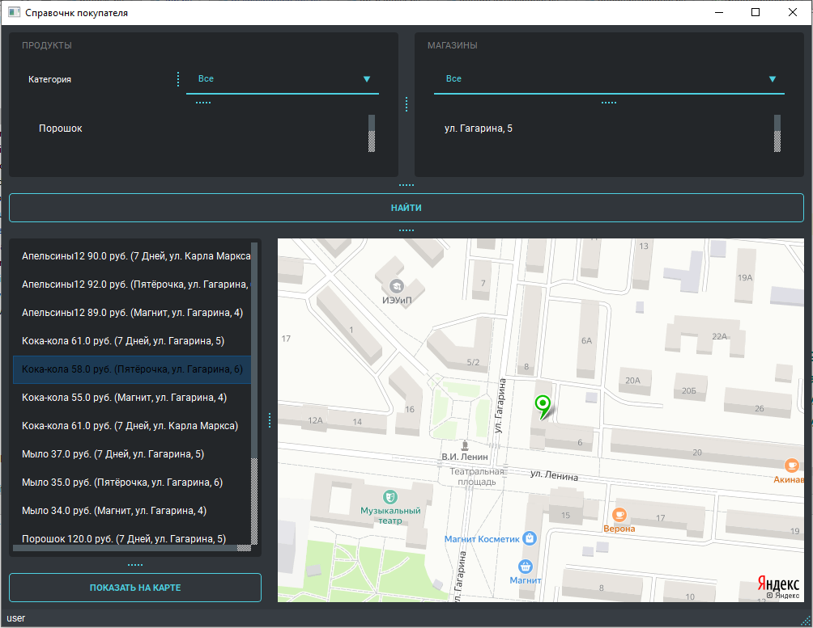
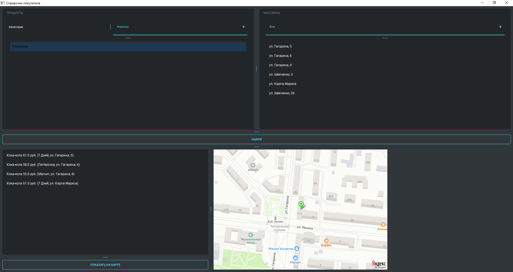
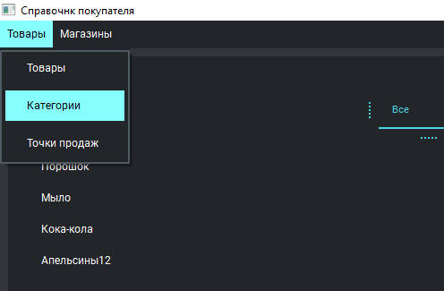
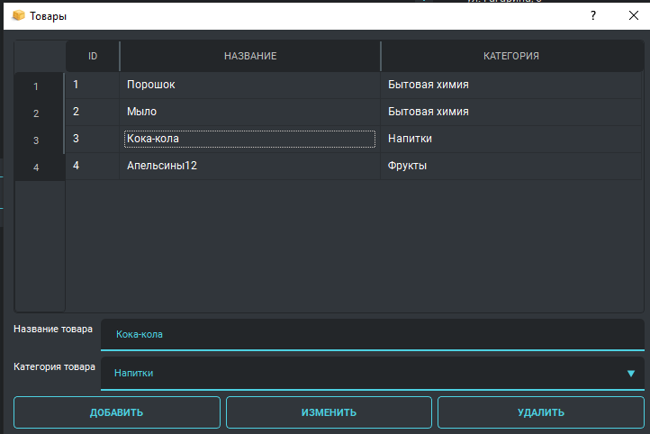
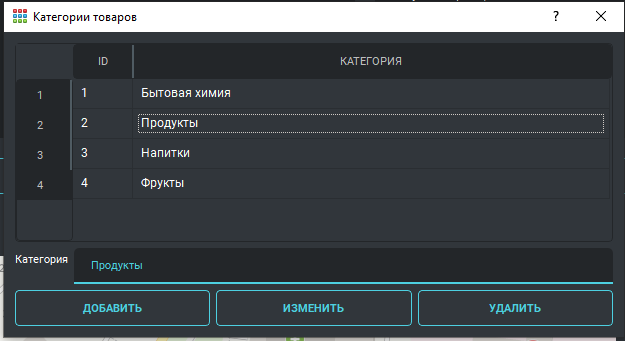
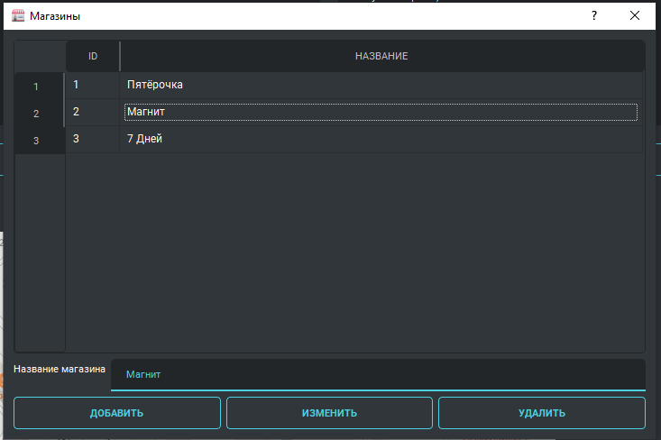
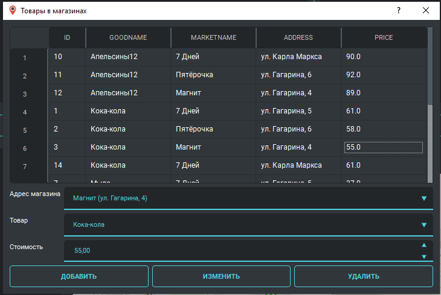

# Справочник покупателя

Приложение предназначено для того, чтобы найти где и в каком магазине находится самый дешёвый товар. 

## Идея программы
Часто бывает ситуация, когда перед покупкой товаров в магазине, мы хотим купить товар по акции или подешевле. Мы ходим по магазинам и тратим на это много времени. Было бы неплохо создать приложение, которое позволяло бы заранее узнать где и в каком магазине самый дешевый товар. Система многопользовательская. Есть две роли в системе:  администратор и пользователь. Администратору доступно меню для доступа к данным: магазинам и товарам. Пользователю доступна главная форма.

## Структура БД

## Реализация программы

Использована библиотека PyQt и SQLite база данных. Карта расположения магазина формируется на основе запроса к геокодеру Яндекса(https://yandex.ru/dev/maps/geocoder/).
Для работы приложения нужен интернет, а также API-ключ.

 
## Краткое руководство пользователя
### Форма авторизации и регистрации
После запуска приложения первым открывается окно входа

На этой форме есть возможность войти(роль будет автоматически выбрана из БД)
При регистрации автоматически назначается роль – пользователь
Логин администратора: admin, пароль: 1.
Логин пользователя: user, пароль: 1.

 
### Главная форма приложения
#### Роль - пользователь

Наверху расположена панель фильтрации. Пользователь выбирает категорию, магазины и нажимает найти. В поле ниже отобразятся товар и его цена, если этот товар есть в данном магазине. 
Далее пользователь выбирает товар нажимает на кнопку показать на карте, и справа на карте отобразится нужный магазин.

Можно выбрать конкретный товар и торговую сеть или магазин

#### Роль - администратора
Если войти в систему как администратор, то появится меню

##### Форма товары
Предназначена для добавления, редактирования и удаления данных в таблицу товары

##### Форма категории товаров
Предназначена для добавления, редактирования и удаления данных в таблицу категории товаров

##### Форма магазины
Предназначена для добавления, редактирования и удаления данных в таблицу магазины

##### Форма адреса магазинов
Предназначена для добавления, редактирования и удаления данных в таблицу адреса магазинов

##### Форма товары в магазинах
Предназначена для добавления, редактирования и удаления данных в таблицу товары в магазинах. 

